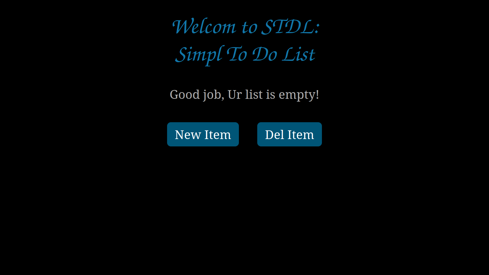
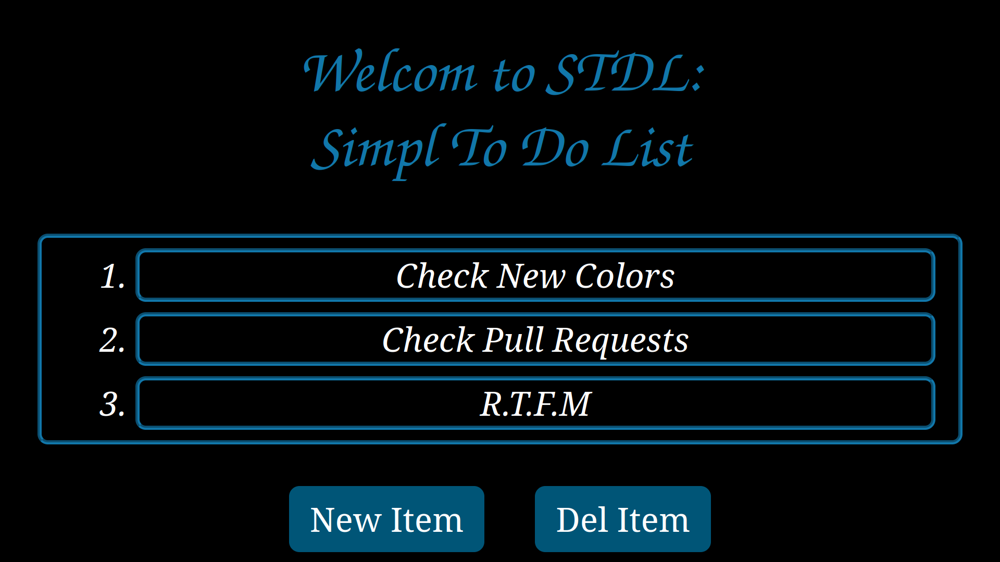

STDL - Simple To-Do List Web Application Using Django.
======================================================

 


About
-----
- Web application for creating a simple To-Do list.
- It uses SQLite.
- It's for educational purpose.
- JavaScript free!
- Feel free to contribute.

To Do
-----
- ~~Use database instead of being a session-based.~~&emsp;&emsp;# Done as per commit 09b48f8.
- Adding support for multi-user and authentication.
  
Requirements
------------
- Python >= 3.11.5
- Django >= 4.2.5

Installation
------------
Install [Python](https://www.python.org/downloads/),
Then install [Django](https://www.djangoproject.com/download/):
```
$ pip3 install -U Django>=4.2.5
```
Running
-------
```
$ git clone https://github.com/mahmoudElshimi/stdl.git
$ cd stdl/src
$ python manage.py migrate
$ python manage.py runserver
```
Then open "http://127.0.0.1:8000" in your browser. 
