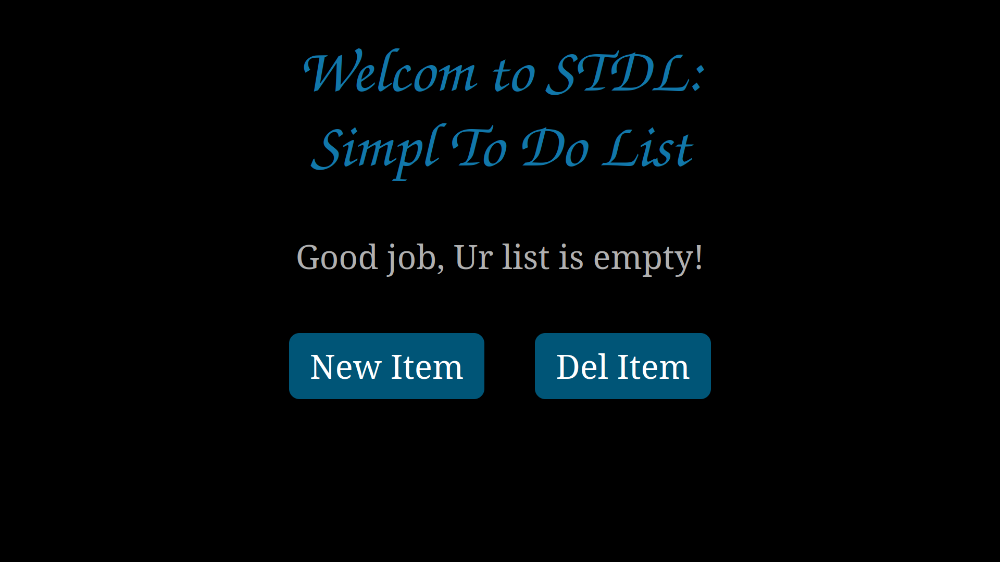

# STDL:
Simple To-Do List Web Application Using Django.

 


About
-------------------
- A session-based web application for creating simple to-do list.
- 'Session' means it saves your list for browser's session.
- JavaScript free!
- It's for educational purpose.
- Feel free to contribute.

Requirements
------------
- Python >= 3.11
- Django >= 4.2.5

Installation
------------
Install [Python](https://www.python.org/downloads/)
Then install [Django](https://www.djangoproject.com/download/):
```
$ pip install -U Django>=4.2.5
```
Running
-------
```
$ git clone https://github.com/mahmoudElshimi/stdl.git
$ cd source
$ python manage.py runserver
```
Then open "http://127.0.0.1:8000" in ur browser. 
